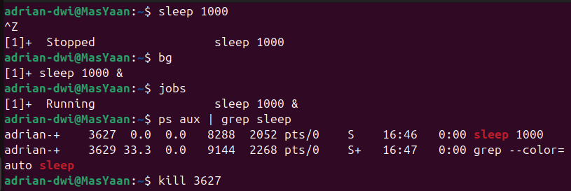
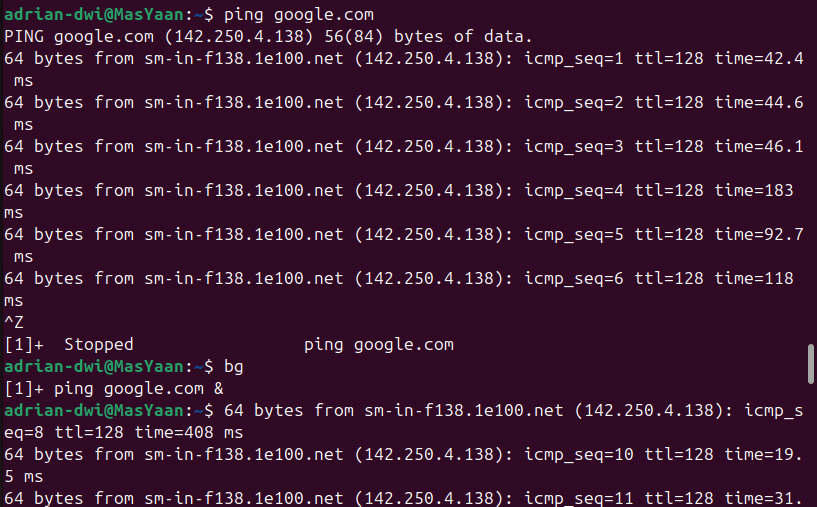
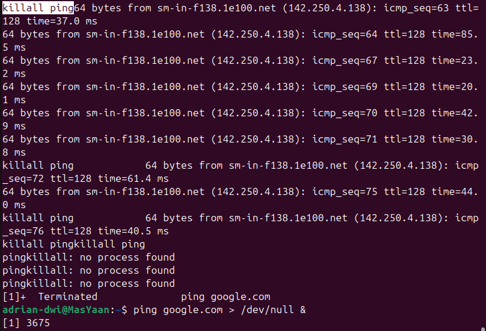
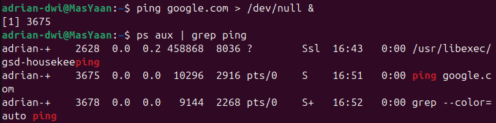
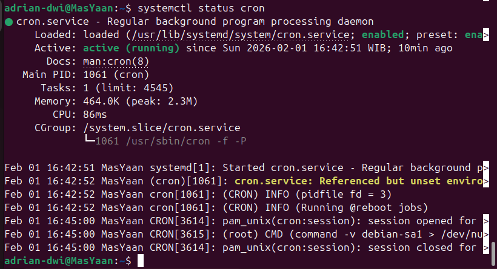

# Linux Red Team Journey - Day 3: Process Management & The Art of Silence

**Date:** 2026-02-01

**Topic:** Process Management, Background Jobs, & Service Reconnaissance

**Status:** Completed ✅

## 🚀 Introduction
Masuk ke Hari ke-3, fokus saya berpindah dari sekadar navigasi file ke **apa yang sedang berjalan di dalam sistem**. Sebagai seorang calon Red Teamer, memahami *Process* dan *Service* adalah kunci untuk dua hal:
1.  **Reconnaissance:** Mengetahui apakah ada Antivirus/EDR yang berjalan.
2.  **Persistence & Evasion:** Menyembunyikan malware agar berjalan di background tanpa diketahui admin.

Hari ini penuh dengan pelajaran berharga, termasuk satu kesalahan fatal yang membuat terminal saya "kebanjiran".

---

## 1. Process Reconnaissance (`ps` & `top`)
Hal pertama yang saya pelajari adalah cara melihat proses yang aktif. Linux menganggap setiap program yang berjalan sebagai "Process" yang memiliki **PID (Process ID)**.

Saya menggunakan perintah `ps aux` untuk melihat daftar lengkap proses. Karena outputnya sangat panjang, saya belajar menggabungkannya dengan `grep` (piping) untuk mencari target spesifik.

```bash
# Mencari semua proses yang mengandung kata "sshd" (SSH Server)
ps aux | grep sshd
```

Selain itu, saya menggunakan top untuk memantau resource secara real-time (mirip Task Manager di Windows).

## 2. Hands-on: Malware Simulation (Backgrounding)

Skenario: Saya ingin menjalankan program (simulasi malware) tapi tidak ingin terminal saya macet menunggu program itu selesai.

Saya menggunakan perintah sleep 1000 sebagai simulasi proses panjang.

```bash
    # Jalankan sleep 1000
    sleep 1000

    # Tekan Ctrl + Z untuk pause (suspend).
    Ctrl + Z 

    # Ketik bg untuk melemparnya ke background.
    bg 
```

 

Untuk mematikan proses "jahat" tersebut, saya mencari PID-nya lalu menggunakan perintah kill:

```Bash
kill 3627  # Menggunakan PID yang ditemukan dari ps aux
```

## 3. The "Oops" Moment: The Ping Disaster ⚠️

Ini adalah pelajaran terbesar hari ini. Saya mencoba menjalankan ping di background, tapi saya lupa satu hal penting: Output Redirection.

Saya menjalankan:

```Bash
ping google.com
# Lalu menekan Ctrl+Z dan bg
```

Hasilnya: Terminal saya tetap bisa dipakai mengetik, TAPI layar saya terus-menerus dibanjiri output 64 bytes from.... Ini sangat berisik dan dalam skenario Red Team nyata, ini akan langsung membuat saya ketahuan (OpSec Fail).





Saya panik dan mencoba mengetik killall ping, tapi karena layar penuh teks berjalan, saya sempat kesulitan melihat apa yang saya ketik. Akhirnya proses berhasil dihentikan.

## 4. The Fix: Stealth Mode & Redirection (/dev/null) 🥷

Belajar dari kesalahan di atas, saya menemukan cara yang benar untuk menjalankan proses "diam-diam". Kita harus membuang output (suara) proses ke "lubang hitam" Linux yang bernama /dev/null.

Command yang Benar:
```bash
ping google.com > /dev/null &
```

- `>` : Redirect output.

- `/dev/null` : Tempat pembuangan data (Blackhole).

- `&` : Langsung jalan di background.



 
Hasilnya? Proses ping berjalan (terbukti saat dicek dengan ps aux), tapi terminal tetap bersih dan sunyi. Perfect stealth

## 5. Service Reconnaissance (systemctl)

Terakhir, saya belajar membedakan Process (program jalan) dan Service (program background otomatis/daemon). Red Team perlu mengecek service untuk mencari celah keamanan atau memastikan persistensi.

Saya mengecek status cron (penjadwalan tugas) yang sering dipakai hacker untuk persistensi:

```bash
systemctl status cron
```



## 📝 Key Takeaways
- PID itu Penting: Setiap proses punya ID, dan itu kunci untuk mematikannya (kill).
- Backgrounding (bg) != Silent: Melempar ke background tidak otomatis mematikan output layar.
- /dev/null is your friend: Gunakan ini untuk menyembunyikan jejak output tools kita.
- Systemctl: Pintu gerbang untuk melihat pertahanan (Services) di komputer target.
