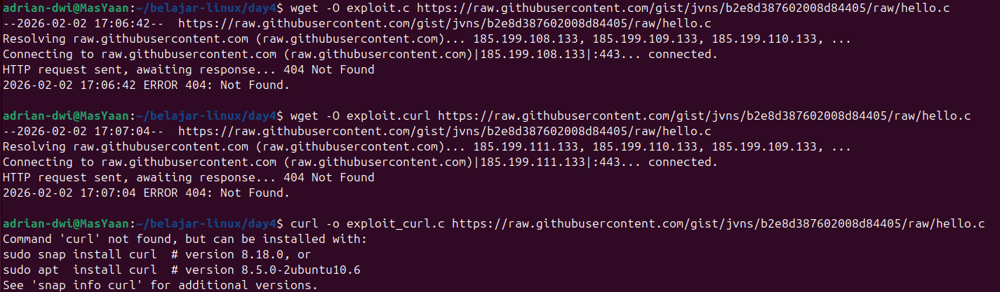
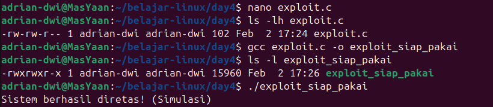
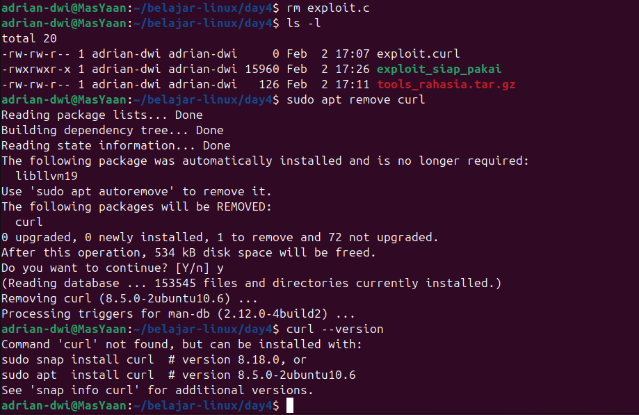

# Day 4: Linux Weaponization & Package Management

**Status:** Completed ✅

**Focus:** Package Managers (APT/DPKG), Source Code Compilation (GCC), & Stealth Cleanup.

## 🎯 Tujuan Belajar
Memahami bagaimana seorang Red Teamer menyiapkan "alat tempur" (tools/exploits) di dalam server target yang memiliki keterbatasan akses (misal: tidak ada internet, atau tidak bisa install via `apt`).

> ⚠️ **Disclaimer:** Semua aktivitas "peretasan" di bawah ini dilakukan secara lokal pada file simulasi (`exploit.c`) yang saya buat sendiri untuk tujuan edukasi (Proof of Concept). Tidak ada sistem nyata yang dirugikan.

---

## 🛠️ Tools & Command Baru
| Command | Fungsi | Kategori |
| :--- | :--- | :--- |
| `apt / dpkg` | Mengelola paket software (Install/Remove). | Sysadmin |
| `gcc` | GNU C Compiler. Mengubah source code (`.c`) menjadi binary executable. | Weaponization |
| `curl` | Transfer data dari/ke server (download file). | File Transfer |
| `rm` | Menghapus file untuk menghilangkan jejak. | Cleanup |

---

## 📝 Jurnal Praktek

### 1. Masalah & Troubleshooting (Real-World Scenario)
Saat mencoba mengunduh exploit dummy menggunakan `wget`, saya mengalami kendala:
- **Error:** `404 Not Found` (Link sumber mati) dan `curl command not found`.
- **Solusi:** Saya memutuskan untuk **membuat source code manual** menggunakan `nano` dan menginstall `curl` serta `build-essential` terlebih dahulu.



### 2. Simulasi Weaponization (The "Cooking" Process)
Skenario: Server target tidak memiliki tool yang kita butuhkan. Kita harus "memasak" tool tersebut langsung di tempat.

**A. Membuat Payload Simulasi**
Saya menulis kode C sederhana (`exploit.c`) yang berfungsi mencetak pesan keberhasilan, seolah-olah sistem telah dikuasai.

```c
#include <stdio.h>

int main() {
    printf("Sistem berhasil diretas! (Simulasi)\n");
    return 0;
}
```

**B. Kompilasi & Eksekusi Menggunakan gcc untuk mengubah source code menjadi binary, lalu mengeksekusinya.**




### 3. Stealth & Cleanup (Membersihkan Jejak)
Seorang Red Teamer profesional harus memiliki disiplin operasional (OpSec).
    Menghapus source code (rm exploit.c) agar tidak meninggalkan artefak forensik.
    Menghapus tools instalasi (sudo apt remove curl) untuk mengembalikan kondisi sistem seperti semula.



### 💡 Hands-on Breakthrough

Compatibility is King: Meng-compile tool langsung di mesin target (Local Compilation) menghindari masalah kompatibilitas library (seperti error GLIBC) yang sering terjadi jika kita membawa binary dari luar.

Independence: Hacker tidak boleh bergantung pada tools yang sudah jadi. Dengan hanya nano dan gcc, kita bisa menciptakan alat apa pun dari nol.

Troubleshooting Mindset: Error 404 atau command not found bukan jalan buntu, melainkan sinyal untuk mencari rute alternatif (dalam kasus ini: manual coding).
