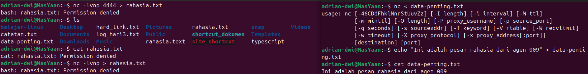
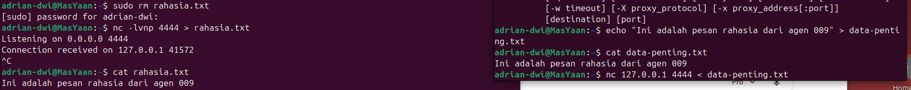

# Day 5: Linux Networking & Command Control

**Status:** Completed ✅

**Focus:** Networking Basics (IP/Port), Netcat, & Data Exfiltration Simulation.

## 🎯 Tujuan Belajar

Memahami bagaimana komputer berkomunikasi dalam jaringan dan bagaimana seorang Red Teamer membangun jalur komunikasi (Command & Control) sederhana antara mesin penyerang dan korban.

> ⚠️ **Disclaimer:** Semua aktivitas "penyadapan" dan transfer data di bawah ini dilakukan secara lokal (localhost) untuk tujuan edukasi pemahaman protokol jaringan. Tidak ada sistem pihak ketiga yang dirugikan.

## 🛠️ Tools & Command Baru

| Command | Fungsi | Kategori |
| :--- | :--- | :--- |
| `ip addr` | Melihat identitas diri (IP Address) interface jaringan. | Reconnaissance |
| `ss -antp` | Melihat port yang sedang terbuka (*Listening*) di komputer. | Reconnaissance |
| `nc -lvnp` | **Netcat Listener**. Membuka port untuk menunggu koneksi masuk. | Command & Control |
| `nc <ip> <port>` | **Netcat Connect**. Menghubungi komputer lain melalui port tertentu. | Connectivity |
| `>` / `<` | **Redirection**. Mengarahkan output ke file atau input dari file. | File System |

## 📝 Jurnal Praktek

### 1. Masalah & Troubleshooting (The Struggle)

Saat mencoba melakukan simulasi pencurian data (*Data Exfiltration*), saya mengalami beberapa kendala teknis yang membuat transfer gagal.

* **Error 1:** `bash: rahasia.txt: Permission denied`.
    * **Penyebab:** Saya mencoba menyimpan data ke file `rahasia.txt` yang ternyata sudah ada dan dimiliki oleh user lain (root), sehingga user saya tidak punya izin tulis.
* **Error 2:** `usage: nc ...` (Syntax Error).
    * **Penyebab:** Pada terminal pengirim (kanan), saya lupa memasukkan **IP Tujuan** dan **Port**. Saya hanya mengetik `nc < data-penting.txt`, sehingga Netcat bingung harus mengirim ke mana.

### 2. Solusi & Hasil Akhir (Success)

Setelah menganalisis error tersebut, saya melakukan perbaikan langkah:
1.  **Reset:** Menghapus file yang bermasalah menggunakan `sudo rm rahasia.txt`.
2.  **Listener (Penerima):** Menjalankan ulang perintah `nc -lvnp 4444 > rahasia.txt` (Mode dengar).
3.  **Sender (Pengirim):** Memperbaiki perintah menjadi `nc 127.0.0.1 4444 < data-penting.txt` (Menyebutkan IP & Port dengan jelas).

**Hasil:**
File `data-penting.txt` berisi pesan rahasia berhasil dikirim dari terminal kanan dan diterima utuh di terminal kiri (`rahasia.txt`). Ini membuktikan bahwa jalur komunikasi (C2) berhasil dibangun.

---

### 💡 Key Takeaways
1.  **Cek Permissions:** Sebelum melakukan *pipe* output (`>`), pastikan kita memiliki hak akses di folder/file tujuan.
2.  **Teliti Syntax:** Netcat membutuhkan alamat tujuan (IP & Port) yang jelas saat dalam mode *connect*.
3.  **Ctrl+C:** Selalu gunakan `Ctrl+C` jika proses terminal macet atau *hang* (menunggu koneksi).
