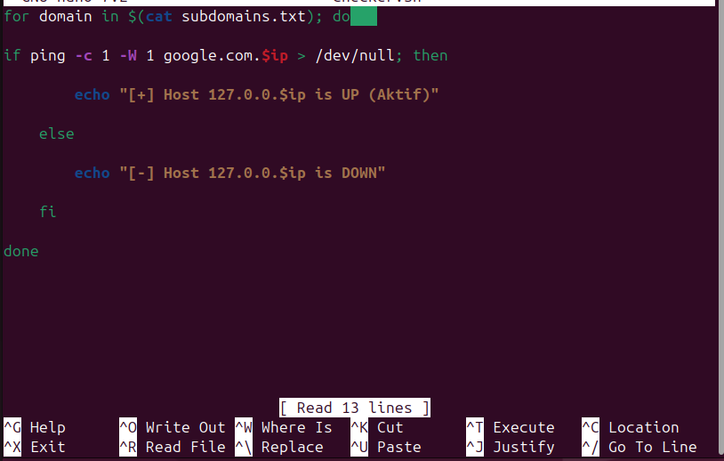
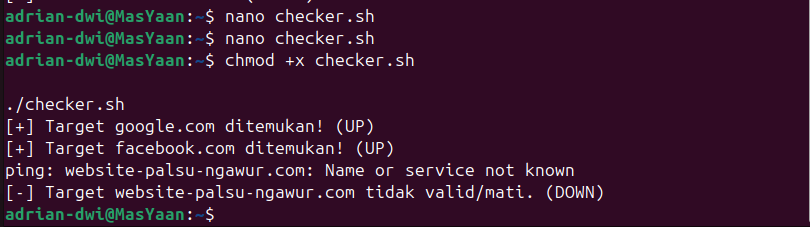

# Day 6: Bash Scripting Dasar (Automation)

**Status:** Completed ✅

**Focus:** Membuat script sederhana untuk otomatisasi tugas berulang (Mass Scanning & Target Checking).

## 🎯 Tujuan Belajar
Seorang Red Teamer tidak melakukan serangan secara manual satu per satu. Kita membutuhkan **Kecepatan**. Hari ini saya belajar bagaimana mengubah perintah manual Linux menjadi script otomatis yang bisa mengecek puluhan target dalam hitungan detik.

## 🧠 Teori & Konsep Kunci

### 1. Anatomi Script (.sh)
Setiap script dimulai dengan "Shebang" (`#!/bin/bash`) agar sistem tahu cara menjalankannya. Script juga membutuhkan izin eksekusi (`chmod +x`).

### 2. Variables & Loops
* **Variables:** Wadah penyimpanan data. Contoh: `TARGET="google.com"`.
* **Loops (`for`):** Melakukan aksi berulang ke banyak target sekaligus.

---

## 💻 Jurnal Praktek: The "Checker" Script

Tantangan hari ini adalah membuat tool `checker.sh` yang membaca daftar domain dari file teks (`subdomains.txt`) dan mengecek apakah domain tersebut aktif atau mati.

### ❌ Fase 1: Kegagalan (The Struggle)
Awalnya, script saya gagal total. Outputnya menunjukkan IP yang aneh (`127.0.0.`) dan script terus-menerus melakukan ping ke Google, mengabaikan daftar target saya yang lain.



**Analisis Kesalahan:**
1.  **Variable Mismatch:** Saya mendefinisikan loop dengan nama `for domain`, tapi di dalam perintah `ping`, saya malah memanggil variabel `$ip` (yang kosong/tidak ada).
2.  **Hardcoded Logic:** Saya tidak sengaja meninggalkan sisa kode latihan sebelumnya (`127.0.0.`), sehingga script mencoba menggabungkan domain dengan IP lokal. Hasilnya kacau.

---

### ✅ Fase 2: Perbaikan (The Fix)
Saya memperbaiki logika script dengan memastikan variabel yang dipanggil (`$domain`) konsisten dengan yang didefinisikan. Saya juga menghapus hardcoded IP agar script murni membaca input dari file teks.

**Kode Final:**
```bash
#!/bin/bash
for domain in $(cat subdomains.txt); do
    if ping -c 1 -W 1 $domain > /dev/null; then
        echo "[+] Target $domain ditemukan! (UP)"
    else
        echo "[-] Target $domain tidak valid/mati. (DOWN)"
    fi
done
```

##🚀 Fase 3: Berhasil (Success)



Setelah perbaikan, script berjalan sempurna. Ia berhasil membedakan domain yang valid (Google, Facebook) dan domain palsu yang saya masukkan sebagai jebakan.

Screenshot Berhasil:
## 📝 Key Takeaways
Variabel itu Sensitif: Salah ketik satu huruf saja dalam memanggil variabel ($domain vs $ip), script akan rusak.
Script adalah Robot: Dia tidak peduli isi file kita benar atau salah, dia hanya menjalankan perintah sesuai logika yang kita tulis.
Troubleshooting Skill: Membaca pesan error di terminal jauh lebih penting daripada sekadar menghafal syntax.
