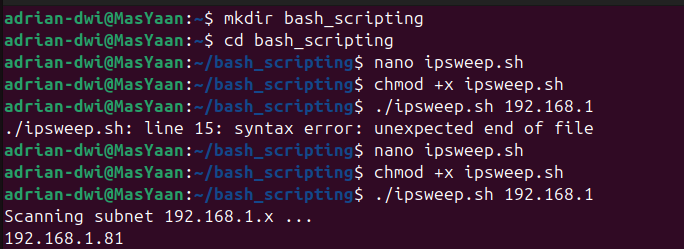
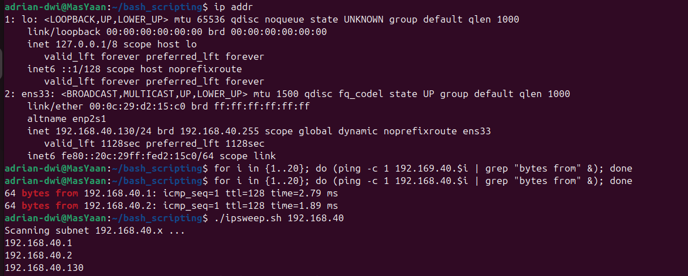

# ☠️ Linux Red Team Operations - Day 10

**Topic:** Bash Scripting for Hackers (Automation)  
**Date:** 2026-02-10  
**Status:** Completed ✅  
**Author:** Adrian (Mas Yaan)

---

## 🎯 Objective

Fokus hari ini adalah **Automation**. Dalam operasi Red Team, kita tidak bisa selalu bergantung pada tools bawaan Kali Linux (seperti Nmap) karena alasan *stealth* atau keterbatasan akses. Kita harus bisa membuat alat sendiri (*Living off the Land*).

**Key Learnings:**
1.  **Scripting:** Membuat tool "IP Sweeper" sederhana menggunakan Bash.
2.  **Logic:** Memahami penggunaan `Loops` (perulangan) dan `Arguments` ($1).
3.  **Efficiency:** Mengubah proses ping manual yang lambat menjadi scanning otomatis paralel.
4.  **One-Liner:** Teknik menjalankan scanning kompleks dalam satu baris perintah terminal.

---

## 1. Setup & Debugging Process

Langkah pertama adalah menyiapkan *environment* kerja. Saya membuat direktori khusus dan mencoba menulis script awal.
* **Challenge:** Terjadi *syntax error* pada percobaan pertama.
* **Fix:** Melakukan debugging pada script dan mengecek interface jaringan (`ip addr`) untuk memastikan subnet target benar (ternyata subnet saya `192.168.40.x`, bukan `1.x`).



---

## 2. The Source Code (`ipsweep.sh`)

Berikut adalah logika script yang saya buat. Script ini menerima input user (subnet) dan melakukan ping ke 254 host secara paralel.

```bash
#!/bin/bash

# Cek apakah user memasukkan argument subnet
if [ "$1" == "" ]
then
    echo "Lupa IP targetnya, Mas Yaan?"
    echo "Syntax: ./ipsweep.sh 192.168.1"
else
    # Loop scanning IP 1-254
    # Command '&' di akhir membuat proses berjalan paralel (cepat)
    for ip in `seq 1 254`; do
        ping -c 1 $1.$ip | grep "64 bytes" | cut -d " " -f 4 | tr -d ":" &
    done
fi
```

## 3. Execution & Results

Setelah script diperbaiki, saya melakukan scanning pada subnet lokal 192.168.40.x.
**A. Script Execution**

Script berhasil mengidentifikasi 3 host aktif di jaringan:

    192.168.40.1 (Gateway)

    192.168.40.2 (DNS/Virtual Gateway)

    192.168.40.130 (My Kali Machine)

**B. The "One-Liner" Method**

Selain script file, saya juga mempraktikkan teknik One-Liner (langsung di terminal) yang sangat berguna jika kita memiliki akses shell terbatas pada target: 
```bash
for i in {1..20}; do (ping -c 1 192.168.40.$i | grep "bytes from" &); done
```


Gambar 3: Hasil scanning sukses menggunakan script dan metode One-Liner.

# 📝 Key Takeaways

Hari ini saya belajar bahwa kekuatan utama Bash Scripting bukan hanya pada "bisa coding", tapi pada kemampuan memanipulasi output (grep, cut, tr) untuk mendapatkan informasi intelijen yang bersih dan cepat.

    Arguments ($1) membuat tools lebih fleksibel tanpa perlu mengedit kode setiap ganti target.

    Background Process (&) sangat krusial dalam network scanning agar proses berjalan paralel (cepat) dan tidak sekuensial (lambat).

    Command Substitution (cut, tr, grep) memungkinkan kita mengambil data bersih (hanya IP address) dari output yang berantakan.
