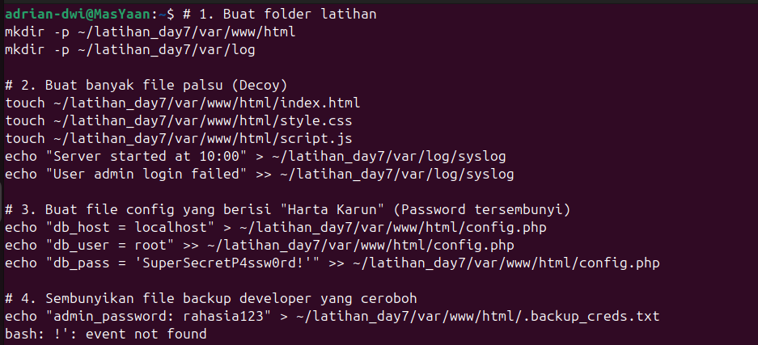
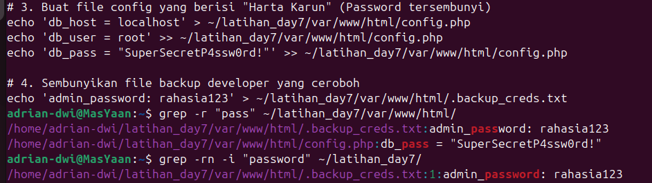
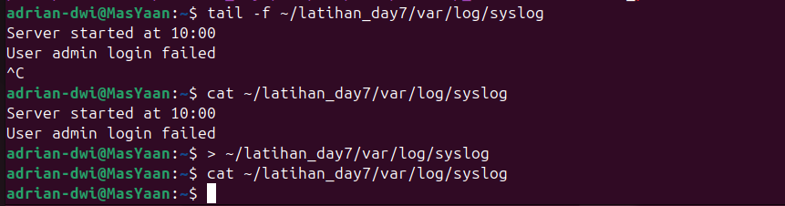

# Day 7: Logging, Grep & Covering Tracks (Stealth)

**Status:** Completed ✅

**Focus:** Mencari informasi sensitif (Credentials Hunting) dan teknik menghilangkan jejak log (Anti-Forensics Basics).

## 🎯 Tujuan Belajar

Seorang Red Teamer harus bisa menjadi "Hunter" (Pemburu) dan "Ghost" (Hantu).
1.  **Hunter:** Menemukan password atau rahasia yang terselip di antara ribuan file server.
2.  **Ghost:** Memastikan admin tidak menyadari kehadiran kita dengan memanipulasi log sistem secara hati-hati.

Hari ini saya belajar menggunakan `grep` untuk pencarian cepat dan teknik manipulasi I/O untuk membersihkan log tanpa menghapus file fisiknya.

## 🧠 Teori & Konsep Kunci

### 1. Grep (Global Regular Expression Print)
Tools paling powerful untuk mencari teks di dalam file.
* **Recursive (`-r`):** Mencari sampai ke dalam folder-folder anak.
* **Ignore Case (`-i`):** Tidak peduli huruf besar/kecil (Pass/pass).
* **Line Number (`-n`):** Menunjukkan lokasi baris agar mudah dieksploitasi.

### 2. Log Truncation vs Deletion
Menghapus file log (`rm /var/log/syslog`) adalah **kesalahan fatal** dalam operasi Red Team karena akan menimbulkan kecurigaan admin (File hilang/Error service).
Teknik yang benar adalah **Truncation**: Mengosongkan isi file menjadi 0 bytes, tapi filenya tetap ada.

---

## 💻 Sesi Praktik (Lab Simulation)

### 1. Lab Setup & Bash Troubleshooting
Saya membangun lingkungan lab simulasi berisi file web dummy. Saat mencoba membuat file config dengan password yang mengandung karakter `!`, saya menemukan error `bash: !': event not found`.



**Analisis Masalah:**
Bash menganggap tanda seru (`!`) sebagai perintah *history expansion* jika berada di dalam double quotes (`""`).

---

### 2. The Fix & The Hunt (Credential Discovery)
**Solusi:** Saya mengubah syntax menggunakan **Single Quotes (`' '`)** agar string dibaca secara literal (apa adanya).

Setelah file berhasil dibuat, saya mensimulasikan peran sebagai Hacker yang mencari kredensial tertinggal menggunakan `grep`.

```bash
# Mencari kata "pass" di seluruh folder secara recursive
grep -r "pass" ~/latihan_day7/var/www/html/

# Mencari lebih detail dengan nomor baris
grep -rn -i "password" ~/latihan_day7/
```



**Hasil: Saya berhasil menemukan:**
    Config Database: File config.php berisi password root.
    Hidden File: File .backup_creds.txt yang berisi password admin (yang seharusnya tersembunyi).

### 3. Log Evasion (Covering Tracks)
Terakhir, saya mensimulasikan pemantauan log dan cara membersihkannya.
   -  Monitoring: Menggunakan tail -f untuk melihat log real-time.
   - Wiping: Menggunakan redirect > untuk menimpa isi file log menjadi kosong.

```bash
# Mengosongkan log (Stealthy)
> ~/latihan_day7/var/log/syslog
```



## 💡 Lessons Learned

  Quote Matters: Selalu gunakan Single Quotes (' ') saat menangani string password yang rumit (!@#$) untuk menghindari interpretasi shell yang salah.

  Stealth is Key: Jangan pernah gunakan rm pada log file. Gunakan teknik Truncate (> file) untuk menjaga keberadaan file namun menghapus isinya.

  Recon Efficiency: grep -r adalah cara tercepat memetakan rahasia di server baru sebelum melakukan eskalasi privilege.
