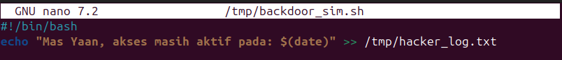
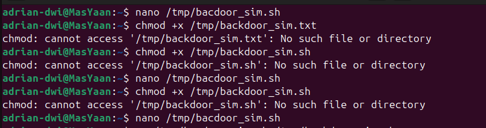
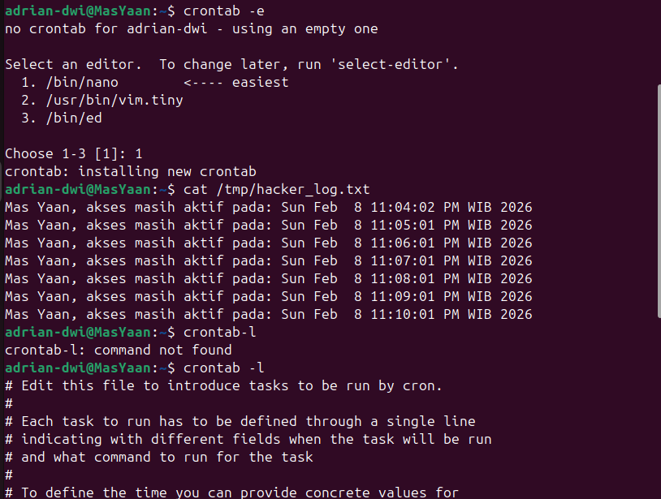
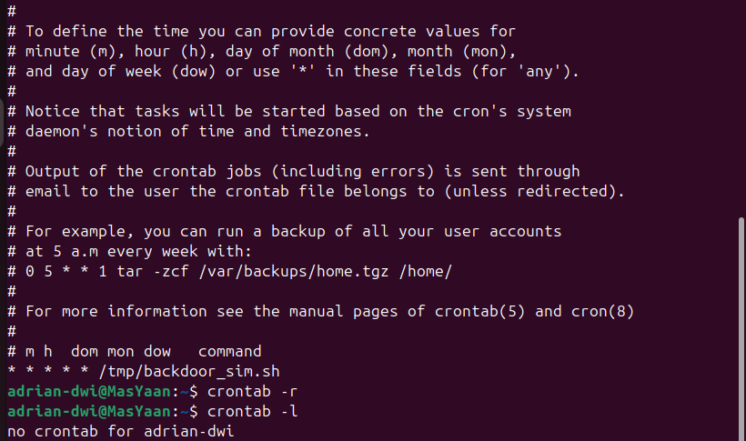

# ☠️ Linux Red Team Operations - Day 9

**Topic:** Cron Jobs, Automated Tasks & Persistence Mechanism

**Date:** 2026-02-08

**Status:** Completed ✅

**Author:** Adrian (Mas Yaan)

---

## 🎯 Objective

Hari ini fokus mempelajari **Cron Jobs** sebagai sarana utama untuk teknik **Persistence** (mempertahankan akses):

1.  **Automation:** Menjalankan script secara otomatis tanpa interaksi user.
2.  **Persistence:** Membuat "backdoor" berjalan sendiri secara berkala (misal: setiap menit atau saat reboot).
3.  **Troubleshooting:** Menangani error permission dan kesalahan penulisan (typo) pada sistem Linux.
4.  **Clean Up:** Menghapus jejak tugas otomatis (scheduled tasks) setelah operasi selesai.

---

## 1. The Payload Setup (Simulation)

Saya membuat script sederhana (`backdoor_sim.sh`) untuk mensimulasikan *malware beacon*. Script ini tidak melakukan koneksi berbahaya, melainkan hanya mencatat waktu (timestamp) ke dalam log file untuk membuktikan bahwa ia berjalan otomatis.

```bash
nano /tmp/backdoor_sim.sh
```



---

## 2. Troubleshooting: Handling Errors

Saat mencoba memberikan izin eksekusi, saya menemukan error `No such file or directory`.
* **Root Cause:** Terjadi kesalahan penulisan (typo) pada nama file saat dibuat (`bacdoor` vs `backdoor`).
* **Solution:** Menggunakan perintah `mv` untuk me-rename file ke ejaan yang benar daripada membuat ulang.



---

## 3. Fixing Permissions & Verification

Setelah nama file diperbaiki, saya memberikan izin eksekusi (`chmod +x`) agar script bisa dijalankan oleh sistem (Cron). Saya juga melakukan tes manual satu kali untuk memastikan script bekerja.

**Commands:**
```bash
mv /tmp/bacdoor_sim.sh /tmp/backdoor_sim.sh  # Fix typo
chmod +x /tmp/backdoor_sim.sh               # Make executable
```


4. Persistence Mechanism (Cron Job)

Ini adalah inti dari materi hari ini. Saya menggunakan crontab untuk menjadwalkan script agar berjalan setiap menit secara otomatis.

```bash
* * * * * /tmp/backdoor_sim.sh
```

Setelah menunggu beberapa menit, saya memverifikasi hasilnya dengan melihat file log target. Terlihat bahwa script berjalan sendiri setiap menit tanpa saya ketik manual.

```Bash
crontab -e      # Edit jadwal
crontab -l      # List jadwal aktif
cat /tmp/hacker_log.txt  # Cek hasil "serangan"
```


5. Cleanup (Opsec)

Sebagai bagian dari prosedur keamanan operasi (dan agar storage tidak penuh), saya menghapus seluruh jadwal cron setelah latihan selesai.

```bash
crontab -r
```



📝 Key Takeaways

    crontab -e adalah tempat di mana persistence sering ditanam oleh penyerang.

    * * * * * berarti perintah dijalankan setiap menit.

    Troubleshooting Skill: Kemampuan membaca error (seperti salah nama file) lebih penting daripada sekadar menghafal syntax.
