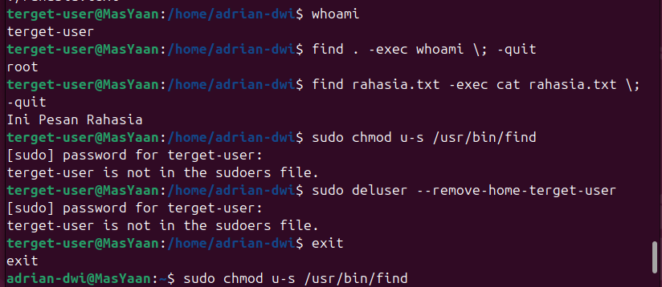
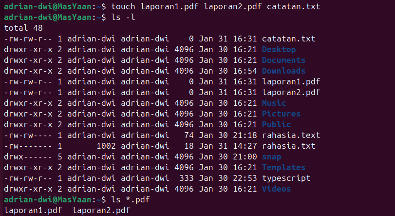

# Learning Log: Linux for Red Teaming - Week 2

**Date:** 31 Januari 2026
**Topic:** User Management, Permissions, & Basic Privilege Escalation

---

## 1. User & Identity: Understanding "Who Am I?"

Hari ini saya belajar fondasi keamanan Linux: identitas. Di Linux, segala akses ditentukan oleh siapa kamu (UID) dan di grup mana kamu berada (GID).

### Perintah Kunci:
* **`id`**: Perintah wajib untuk melihat identitas saat ini.
* 
    ```bash
    $ id
    uid=1000(adrian-dwi) gid=1000(adrian-dwi) groups=1000(adrian-dwi),27(sudo),...
    ```
    *Insight: UID 0 adalah milik `root` (admin), target utama dalam privilege escalation.*
* **`adduser` & `deluser`**: Saya mempraktekkan cara membuat user baru (`terget-user`) untuk mensimulasikan lingkungan dengan user biasa yang terbatas aksesnya.
* **`su - <user>`**: *Switch User*. Digunakan untuk berpindah identitas secara penuh.

---

## 2. Linux Permissions (The Power of Numbers)

Saya mendalami konsep izin file `rwx` (Read, Write, Execute) dan representasi oktalnya. Kesalahan konfigurasi di sini adalah celah keamanan yang umum.

* **Read (r) = 4**
* **Write (w) = 2**
* **Execute (x) = 1**

### Praktek Pengamanan File:
Saya membuat file rahasia dan menguncinya agar hanya pemiliknya yang bisa mengakses.

```bash
$touch rahasia.txt
$ chmod 600 rahasia.txt  # Owner: 4+2=6 (rw), Group: 0, Others: 0
$ ls -l rahasia.txt
-rw------- 1 adrian-dwi adrian-dwi 0 Jan 31 10:00 rahasia.txt
```
Hasil: User lain (terget-user) mendapatkan "Permission denied" saat mencoba membaca file ini.

## 3. Hands-on Breakthrough: Exploiting SUID Misconfiguration

Ini adalah bagian paling menarik hari ini. Saya melakukan simulasi serangan Privilege Escalation sederhana.
Konsep SUID (Set User ID)

Jika sebuah file binary memiliki bit SUID (ditandai dengan huruf s pada izin file, misal -rwsr-xr-x), program tersebut akan dijalankan dengan hak akses pemilik file tersebut, bukan hak akses user yang menjalankannya. Jika pemiliknya adalah root, ini adalah celah fatal.
Langkah Eksploitasi (Simulasi):
    Mencari Celah: Sebagai attacker (di user biasa), saya mencari file dengan izin SUID.

```bash
find / -perm -u=s -type f 2>/dev/null
```
Menemukan Target: Saya menemukan bahwa program find memiliki bit SUID (sengaja diset untuk latihan).

Eksekusi: Saya menggunakan fitur -exec pada find untuk menjalankan perintah sebagai root.

Bukti Keberhasilan : 



Mitigasi: Sebagai admin, saya harus segera menghapus bit SUID dari program yang tidak seharusnya memilikinya: sudo chmod u-s /usr/bin/find

## 4. Wildcards: Terminal Efficiency

Belajar menggunakan *wildcards* untuk bekerja lebih cepat di terminal, terutama saat mengelola banyak file sekaligus.

* **`*` (Asterisk)**: Karakter spesial yang mewakili "teks apa saja". Sangat berguna untuk operasi massal seperti memfilter, menghapus, atau memindahkan banyak file dalam satu perintah.

### Contoh Skenario:
Saya mensimulasikan situasi di mana saya memiliki banyak file laporan dan ingin menghapusnya sekaligus tanpa mengetik satu per satu.

```bash
# 1. Membuat beberapa file dummy untuk latihan
touch laporan-jan.pdf laporan-feb.pdf laporan-mar.pdf data-lain.txt

# 2. Menampilkan hanya file yang berekstensi .pdf
$ ls *.pdf
laporan-jan.pdf  laporan-feb.pdf  laporan-mar.pdf

# 3. Menghapus semua file yang namanya diawali 'laporan'
$ rm laporan*

# 4. Verifikasi (File laporan harusnya sudah hilang, sisa data-lain.txt)
$ ls -l
data-lain.txt
```

Sebelum :



Sesudah : 


